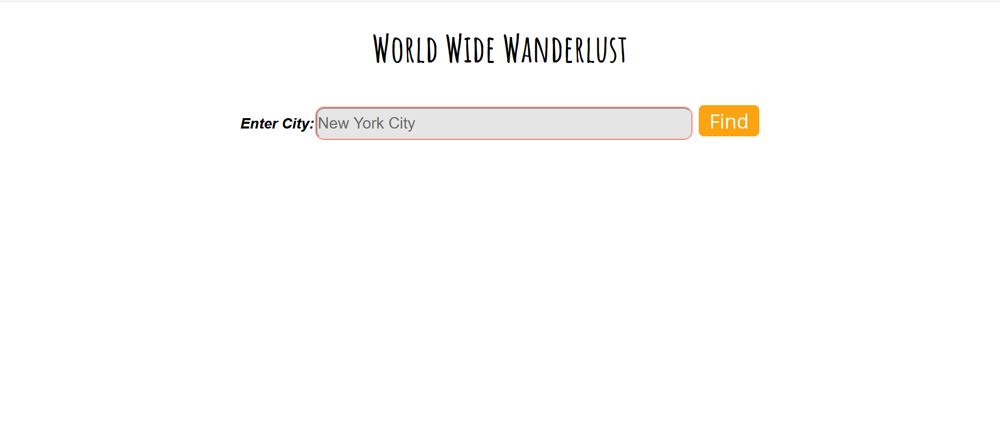
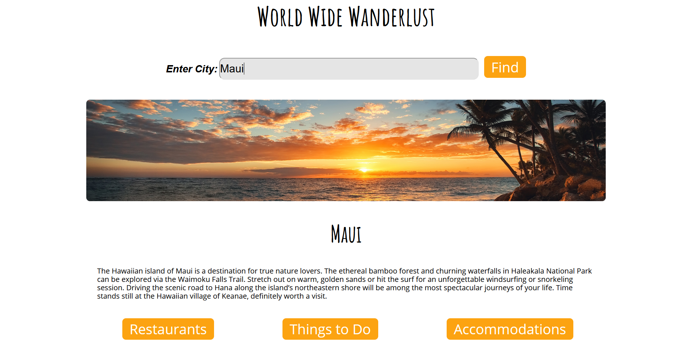

# World Wide Wanderlust   
A travel application that takes a user inputted city name and retrieves data from TripAdvisor API and Hotels API for a short description of the location, then provides more in-depth information for the user regarding available restaurants, things to do, and accomodations.  

## Screenshots
---
Landing Page
  
Location Description & Extra information
  

## Technologies Used  
---
- HTML 5  
- CSS 3  
- JavaScript  
- jQuery  
## Features
---  
- Search a specific city
- Receive a short description of the city
- Choose more information to look up (ex. Restaurants, Things to Do, Accomodations)
- Choose dates and number of guests to receive a list of possible accomodations during your dates
## Live Link
---  
- [World Wide Wanderlust](https://gsmith812.github.io/world-wide-wanderlust/)
